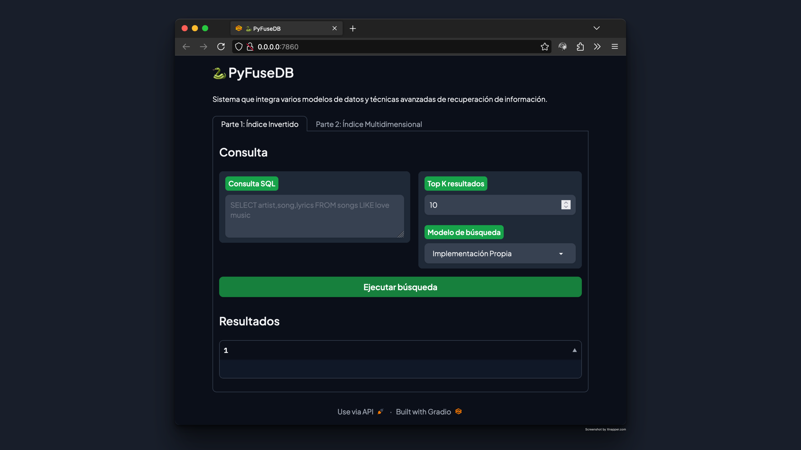
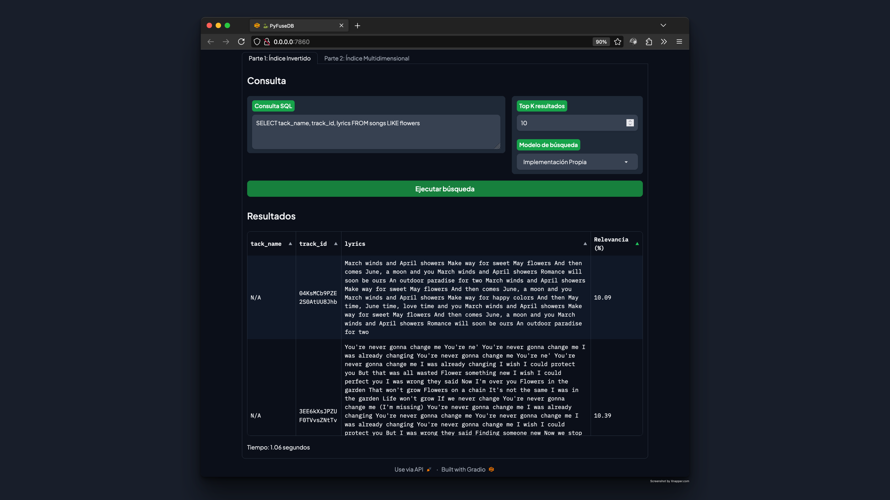

<h1 align="center">PyFuseDB</h1>

PyFuseDB es un sistema que integra varios modelos de datos y técnicas avanzadas de recuperación de información dentro de una única base de datos. Nuestro sistema permite a los usuarios recuperar datos estructurados por medio de un **índice invertido** y datos no estructurados como imágenes y audio por medio de **estructuras multidimensionales** que utilizan vectores característicos.


## 1. Introducción

### 1.1 Objetivo del Proyecto

### 1.2 Descripción del Dominio de Datos

### 1.3 Importancia de Técnicas de Indexación


## 2. Backend: Índice Invertido

### 2.1 Construcción del Índice Invertido 

### 2.2 Optimización de Consultas con Similitud de Coseno

### 2.3 Construcción del Índice Invertido en PostgreSQL


## 3. Backend: Índice Multidimensional

### 3.1 Técnica de Indexación

### 3.2 K-NN Search y Range Search

### 3.3 Análisis y Solución de la Maldición de la Dimensionalidad


## 4. Frontend: Interfaz de Usuario


### 4.1 Diseño de GUI

Para lograr una interfaz intuitiva y funcional, se utilizó la librería de Python: `Gradio`. Esta elección permite crear interfaces de usuario web de manera sencilla y rápida, ofreciendo componentes predefinidos que se configuran en Python, lo que simplifica el desarrollo y mejora la mantenibilidad.

### 4.2 Manual de Usuario

#### 4.2.1 Ingreso de Consultas

Se implementó una sintaxis personalizada inspirada en SQL para facilitar las búsquedas. La interfaz proporciona un campo de texto donde los usuarios pueden ingresar sus consultas. A continuación, se detalla la sintaxis de las consultas soportadas por PyFuseDB:

| Comando | Descripción |
| --- | --- |
| `SELECT` | Selecciona los atributos de la tabla |
| `FROM` | Especifica la tabla de la que se seleccionarán los atributos |
| `WHERE` | Especifica las condiciones que deben cumplir los registros seleccionados |
| `LIKETO` | Encapsula la consulta de similitud de texto |
| `LIMIT` | Limita el número de resultados a mostrar |

A continuación, se muestra un ejemplo de consulta soportada por PyFuseDB. En este ejemplo, se seleccionan los atributos `title` y `artist` de la tabla `Audio` donde el atributo `lyric` es similar al texto `amor en tiempos de guerra`. Además, se limita la cantidad de resultados a 10.

```sql
SELECT title, artist FROM Audio WHERE lyric LIKETO 'amor en tiempos de guerra' LIMIT 10
```

Por otro lado, se incluye una opción para que el usuario especifique la cantidad de documentos a recuperar (Top K), ya sea mediante el comando `LIMIT` en la consulta o a través de un control separado en la interfaz.

#### 4.2.2 Presentación de Resultados
Se tuvo especial cuidado en la presentación de los resultados de las consultas, con el objetivo de que sean claros y fáciles de interpretar. Para ello, se implementó una tabla que muestra los resultados de la consulta, donde cada fila corresponde a un documento recuperado y cada columna a un atributo seleccionado. Además, se incluyó un mensaje que indica el tiempo que tomó realizar la consulta, proporcionando feedback sobre la eficiencia del sistema.

- **Visualización amigable**: Los resultados de la búsqueda se presentan de forma clara y organizada, mostrando los atributos seleccionados en un formato fácil de leer.
- **Tiempo de consulta**: Se muestra el tiempo que toma realizar la consulta, proporcionando feedback sobre la eficiencia del sistema.

#### 4.2.3 Método de Indexación
La interfaz trae una opción para seleccionar el método de indexación a utilizar. Los usuarios pueden elegir entre `Implementación propia (Índice Invertido)`, `PostgreSQL` y `MongoDB`, permitiendo comparar los resultados obtenidos con cada técnica.

#### 4.2.4 Carga de Archivos Multimedia
Se implementó una funcionalidad para cargar imágenes y audio a la base de datos, permitiendo a los usuarios recuperar datos no estructurados. La lógica está compuesta por los siguientes pasos:

- Un botón permite seleccionar los archivos a cargar.
- Los archivos se procesan para extraer vectores característicos.
- Los vectores se almacenan en la base de datos para su posterior recuperación.

### 4.3 Capturas de Pantalla
#### 4.3.1 Formulario de consulta


#### 4.3.2 Ejemplo de respuesta



### 4.2 Análisis Comparativo de otras Implementaciones


## 5. Experimentación

### 5.1 Tablas y Gráficos de Resultados Experimentales

### 5.2 Análisis y Discusión de Resultados Experimentales

